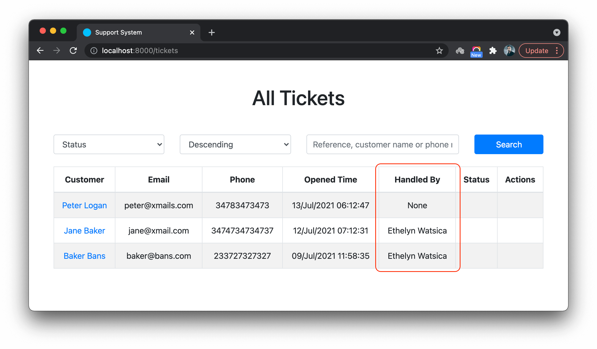

# Building A Support System - Part 2

This is the second part of a series of tutorials guiding to develop an **Online Support System**. The [Part 1](./building-a-support-system-1.md) of this series focused on how to identify the entities involved in support system and how to open a support ticket. This part focuses on managing support tickets from the support agent's side and replying them.


## Support agent's view

**Support agents** should see a list of support tickets opened by customers. Also it should support **searching**, **filtering**, **sorting** and **pagination** in order to make it easy for support agents to find a particular ticket or a set of tickets.

Let's see how we can create a view including all these features. We already have the `index()` method added to **TicketController** when we generate it. Adding some code to load the view with all tickets:

```php
public function index(Request $request)
{
    $tickets = Ticket::all();

    return view('tickets.index', [
        'tickets' => $tickets,
    ]);
}
```

Also, let's create a view for `index()` method. File name is `resources/views/tickets/index.blade.php`:


```html
@extends('layouts.app')

@section('content')
<div class="text-center mt-5">
    <h1>All Tickets</h1>
    <div class="m-5">
        @if($tickets->isNotEmpty())
        <table class="table table-striped table-bordered">
            <thead>
                <tr>
                    <th>Customer</th>
                    <th>Email</th>
                    <th>Phone</th>
                    <th>Opened Time</th>
                    <th>Handled By</th>
                    <th>Status</th>
                    <th>Actions</th>
                </tr>
            </thead>
            <tbody>
                @foreach($tickets as $ticket)
                <tr>
                    <td>
                        <a href="{{ route('tickets.show', $ticket->id) }}">{{ $ticket->customer_name }}</a>
                    </td>
                    <td>{{ $ticket->email }}</td>
                    <td>{{ $ticket->phone }}</td>
                    <td>{{ $ticket->created_at->format('d/M/Y H:i:s') }}</td>
                    <td></td>
                    <td></td>
                    <td></td>
                </tr>
                @endforeach
            </tbody>
        </table>
        @else
        <div class="alert alert-info">
            No tickets are there yet.
        </div>
        @endif
    </div>
</div>
@endsection
```

Few important things to notice here:

We use a table view to show the data. This makes it easy to see more details on the same view as well as to see the order of the tickets. Each row represents a ticket. We display the data we have right now on first 4 columns (`Customer Name`, `Email`, `Phone`). We will discuss about the other 3 columns (`Handled By`, `Status`, `Action`) in detail after a moment.

Note that we also check for the **availability** of the data by using `@if` - `@else` - `@endif`. Make this a practice, so that you let the user know when there are no data to show instead of showing only the table headers or an empty screen.

We have linked the `customer_name` to the ticket view, so that user can quickly open the ticket view by clicking it.

One other thing to notice here is call of `format()` method directly on the `created_at` property of the ticket. This magic is possible because **Eloquent** automatically casts timestamps to **Carbon** objects. Read more about [Date Casting](https://laravel.com/docs/8.x/eloquent-mutators#date-casting) to understand this better.


### Pagination

This table shows all the tickets in the system. At the beginning it's not an issue. However, when more and more people open support tickets it's not efficient to see them all in one screen. We can break down the whole set to smaller chunks and access one chunk at ta time. This is called **Pagination**. Read about [Pagination](https://laravel.com/docs/8.x/pagination) to understand it more and how Laravel implements it.

Going forward we add pagination suport to our tickets list. First, controller:

```php
public function index(Request $request)
{
    $tickets = Ticket::paginate($request->query('per_page', 10));

    return view('tickets.index', [
        'tickets' => $tickets,
    ]);
}
```

Default page size is set to `20`. We use the `per_page` parameter to set the page size to a value we receive from the browser, giving the user the freedom to choose how many tickets she wants to see on the table.

Now if you add `per_page` query parameter to the URL in address bar you can change the number of tickets you see on the table.

```
http://localhost:8000/tickets?per_page=10
```

Laravel **paginator** captures the `page` parameter in request to switch the page. Go ahead and try different values for `page` and `per_page` parameters. You will need to add some more tickets before trying this to make sure you have enough data to see the effect.

```
http://localhost:8000/tickets?per_page=10&page=2
```

Instead of switching the pages manually, add the following code below the `table` to add page links.


```html
<div class="mt-4">
    {!! $tickets->links() !!}
</div>
```

> The default CSS framework supported by Laraqvel is TailwindCSS. The paginator links also using these styles by default. If you wish to use **Bootstrap** styles, set paginator to do so as [explained here](https://laravel.com/docs/8.x/pagination#using-bootstrap).


### Searching & sorting

Another two important features a list of items should have are **searching** and **sorting**. This way support agents can easily find a particular support ticket.

Lets add a form to search and sort the tickets displayed on the table. Add following code above the `table` on the view file.

```html
<div class="my-4">
    <form class="" action="" method="get">
        <div class="row">
            <div class="col-3">
                <select class="form-control" name="sort">
                    <option value="customer_name">Customer Name</option>
                    <option value="created_at">Opened Time</option>
                    <option value="updated_at">Last Updated Time</option>
                    <option value="status">Status</option>
                </select>
            </div>
            <div class="col-3">
                <select class="form-control" name="sort_dir">
                    <option value="asc">Ascending</option>
                    <option value="desc">Descending</option>
                </select>
            </div>
            <div class="col-4">
                <input type="text" name="q" value="" class="form-control" placeholder="Reference, customer name or phone number">
            </div>
            <div class="col-2">
                <button type="submit" name="submit" class="btn btn-primary w-100">Search</button>
            </div>
        </div>
    </form>
</div>
```

We are going to sort the tickets list by 4 data fields in database (`customer_name`, `created_at`, `updated_at`, `status`). Sorting has two directions (`Ascending`, `Descending`).

Also we have added a text box to search the tickets. We will try to search tickets by `customer_name`, `ref`, `description` or `phone` fields in database.

Note that we are using a form submitted with `GET` method to make sure it generates a URL for every state our tickets table is in. By this what I mean is once after you filter for a set of tickets and when you get the right results set on your table, copying and pasting the URL in browser to another tab should give you the **same results set**.

Once the UI is ready, it will look like this:


Now, let's add the code to `index()` method in controller to do the searching and sorting.

```php
public function index(Request $request)
{
    $ticketsQuery = Ticket::query();

    $q = $request->query('q');
    $sortColumn = $request->query('sort', 'created_at');
    $sortDir = $request->query('sort_dir') == 'asc' ? 'asc' : 'desc';
    $sortableColumns = [
        'customer_name',
        'created_at',
        'updated_at',
        'status',
    ];

    // Searching
    if ($q) {
        $ticketsQuery->where('ref', 'LIKE', "%$q%")
            ->orWhere('customer_name', 'LIKE', "%$q%")
            ->orWhere('phone', 'LIKE', "%$q%")
            ->orWhere('description', 'LIKE', "%$q%");
    }

    // Sorting
    if (in_array($sortColumn, $sortableColumns)) {
        $ticketsQuery->orderBy($sortColumn, $sortDir);
    }

    $tickets = $ticketsQuery->paginate($request->query('per_page', 10));

    return view('tickets.index', [
        'tickets' => $tickets,
    ]);
}
```

If nothing is selected for sorting and sort direction, it sorts the table by `created_at` filed (Opened Time) in `descending` order (reverse chronological order), so that newest tickets come first.

Pay your attention to `$sortableColumns` variabale. We have a list of columns we allow user to sort the table by. If user manually entered some other value, still it gracefully operates ignoring the value if it is not in the array.

Similar operation is applied to **sorting direction**. It makes sure value of `$sortDir` is always either `asc` or `desc`, no matter what value user passes for `sort_dir` query parameter.

It's easy for a use to manipulate the values of these parameters as they are part of the URL. However, as the developer, we need to make sure application does not break because of such acts of the users.

Now go ahead and play with your newly added features.


### Maintain application state

While you are playing with the tickets table, you might notice that when you change something related to searching or sorting, that state does not persist through the subsequent requests. In other words, if you search the table for word `bob` and try to change the sorting on the resulting table, the search term automatically resets. This is called **application state**. In out application the **application state** of a request is lost when we go for the next request.

There are many ways you can deal with this issue. Let's try to transfer the application state back and forth between the **browser** and **web server** using the query parameters.

```html
<form class="" action="" method="get">
    <div class="row">
        <div class="col-3">
            <select class="form-control" name="sort">
                <option value="customer_name" {{ request('sort', 'customer_name') == 'customer_name' ? 'selected' : null }}>Customer Name</option>
                <option value="created_at" {{ request('sort', 'created_at') == 'created_at' ? 'selected' : null }}>Opened Time</option>
                <option value="updated_at" {{ request('sort', 'updated_at') == 'updated_at' ? 'selected' : null }}>Last Updated Time</option>
                <option value="status" {{ request('sort', 'status') == 'status' ? 'selected' : null }}>Status</option>
            </select>
        </div>
        <div class="col-3">
            <select class="form-control" name="sort_dir">
                <option value="asc" {{ request('sort_dir', 'asc') == 'asc' ? 'selected' : null }}>Ascending</option>
                <option value="desc" {{ request('sort_dir', 'desc') == 'desc' ? 'selected' : null }}>Descending</option>
            </select>
        </div>
        <div class="col-4">
            <input type="text" name="q" value="{{ request('q') }}" class="form-control" placeholder="Reference, customer name or phone number">
        </div>
        <div class="col-2">
            <button type="submit" class="btn btn-primary w-100">Search</button>
        </div>
    </div>
</form>
```

Note how we have used the `request()` helper to get the values of query parameters and use them to resemble the status of the form when it was submitted. This way, change to one parameter will not reset the entire form to it's initial state.

You may also pass the variables from controller to view instead of getting them using `request()` helper. Experiment with it. Try to figure out a way to maintain the application status when use clicks on a pagination URL.


## Security


Great! with all that now we have a descent view for tickets management. However, since this is a web application, if everyone can visit and access the tickets, it's going to be a big issue. So, it's time to think about the security of our support system.

### Authentication

Tickets management should not be opened for everyone. We can implement **username** and **password** based authentication system easily with Laravel to separate visitors from **support agents**. Support agents can login to the system to gain access to ticket management. Also the support system can have multiple **support agents**. Authentication helps to identify support agents separately from each other.
Read more about the [Authentication](https://auth0.com/intro-to-iam/what-is-authentication/) to understand more about **username + password** based authentication.


Let's create a new controller to authenticate users. We don't need a resource controller here as we are not creating or managing entities.

```
php artisan make:controller LoginController
```

Open `LoginController` and add three methods to **show login form**, **authenticate** the user by verifying the **email** and **password** and **logout** the user.

```php
namespace App\Http\Controllers;

use Illuminate\Http\Request;
use Illuminate\Support\Facades\Auth;

class LoginController extends Controller
{
    /**
     * Show login form
     *
     * @return \Illuminate\Http\Response
     */
    public function login()
    {
        return view('auth.login');
    }

    /**
     * Handle an authentication attempt.
     *
     * @param  \Illuminate\Http\Request  $request
     * @return \Illuminate\Http\Response
     */
    public function authenticate(Request $request)
    {
        $credentials = $request->validate([
            'email' => ['required', 'email'],
            'password' => ['required'],
        ]);

        if (Auth::attempt($credentials)) {
            $request->session()->regenerate();

            return redirect()->intended('/');
        }

        return back()->with('error', 'The provided credentials do not match our records.');
    }

    /**
     * Log the user out of the application.
     *
     * @param  \Illuminate\Http\Request $request
     * @return \Illuminate\Http\Response
     */
    public function logout(Request $request)
    {
        Auth::logout();

        $request->session()->invalidate();

        $request->session()->regenerateToken();

        return redirect('/');
    }
}
```

The `login()` method simply display the `resources/views/auth/login.blade.php` view file containing the login form. Which would look like:

```html
@extends('layouts.app')

@section('content')
<div class="text-center mt-5">
    <h1>Login</h1>
    <div class="m-5">

        <!-- FORM START -->
        <form class="" action="{{ route('authenticate') }}" method="post">
            {{ csrf_field() }}

            <div class="row justify-content-center">
                <div class="col-lg-6">

                    <div class="form-group row">
                        <div class="col-md-4 text-md-right">
                            <label for="email">Email</label>
                        </div>
                        <div class="col-md-8">
                            <input type="text" name="email" value="" class="form-control">
                        </div>
                    </div>

                    <div class="form-group row">
                        <div class="col-md-4 text-md-right">
                            <label for="email">Password</label>
                        </div>
                        <div class="col-md-8">
                            <input type="password" name="password" value="" class="form-control">
                        </div>
                    </div>

                    <div class="row">
                        <div class="col-md-8 offset-md-4 text-md-right">
                            <input type="submit" value="Submit" class="btn btn-success">
                        </div>
                    </div>
                </div>
            </div>
        </form>
        <!-- FORM END -->

    </div>
</div>
@endsection
```

When a use enters the **email** and **password** and submits the form, `authenticate()` method validates the input and logs in the user with `Auth::attempt($credentials)`. Read more about this at [Manually Authenticating Users](https://laravel.com/docs/8.x/authentication#authenticating-users) section of the official Laravel documentation.

In order this to work, we need to add 3 new routes to the `routes/web.php` file.

```php
Route::get('/login', 'App\Http\Controllers\LoginController@login')->name('login');
Route::post('/login', 'App\Http\Controllers\LoginController@authenticate')->name('authenticate');
Route::get('/logout', 'App\Http\Controllers\LoginController@logout')->name('logout');
```

I guess you can understand them with what you have learned so far about the routes.


### Authorization

After setting up a way for users login, we can apply restrictions to some areas of our support system so that only the logged in users are able to reply and manage the support tickets. This process is called **Authorization**.

We can do this at multiple levels.

- Using [middleware protected routes](https://laravel.com/docs/8.x/authentication#protecting-routes)
- Using conditional checking at controller actions
- Using [gates](https://laravel.com/docs/8.x/authorization#gates) and [policies](https://laravel.com/docs/8.x/authorization#creating-policies)

At this level we focus on one simple rule to authorise logged in users (support agents) to some actions of our applications. Let's see how we can do this with protecting some routes using a middleware. There is a **middleware** comes with Laravel that can help us do this. Take a look at the `$routeMiddleware` variable in `app/Http/Kernel.php`, which has `\App\Http\Middleware\Authenticate::class` middleware with the the key `auth`. When applied to a **route** or a **route group**, this middleware makes sure it is not accessible if user is not logged in.

Since we use `Route::resource()` to define the routes related to the ticket resource, at the moment all of them are together. We have to take some of them out and place them in a group so that we can apply the `auth` middleware to them.

The routes do not need to be protected:

- **GET /tickets/create**: Create ticket
- **POST /tickets**: Save ticket
- **GET /tickets/{ticket}**: View ticket

The routes need protection:

- **GET /tickets**: Tickets table

Let's update the `routes/web.php` file accordingly;

```php
Route::get('/', function () {
    return view('welcome');
});

Route::group(['namespace' => 'App\Http\Controllers'], function() { // GROUP 1
    Route::get('/login', 'LoginController@login')->name('login');
    Route::post('/login', 'LoginController@authenticate')->name('authenticate');

    Route::get('/tickets/search', 'TicketController@search')->name('tickets.search');
    Route::get('/tickets/create', 'TicketController@create')->name('tickets.create');
    Route::post('/tickets', 'TicketController@store')->name('tickets.store');
    Route::get('/tickets/{ticket}', 'TicketController@show')->name('tickets.show');

    Route::resource('/comments', 'CommentController')->only('store', 'update', 'destroy');

    Route::middleware(['auth'])->group(function() { // GROUP 2
        Route::get('/tickets', 'TicketController@index')->name('tickets.index');
        Route::get('/logout', 'LoginController@logout')->name('logout');
    });
});
```

Now anyone wishes to see the tickets table they need to login first. Also note that I have moved the `logout` route also into the route group (**GROUP 1**) as it makes sense that user has to login first before logout.

Since `App\Http\Controllers` is repeated in every route we can use it as a namespace by creating a route group (**GROUP 2**) enclosing all routes handled by controllers.

With that change, now the guest users can open new tickets and view them but not able to see the table of all tickets. Support agents can access all tickets by loggin in to the system.


## Reply Tickets

It is the support agent's job to reply to the tickets opened by the customers. The agent might want more information on the issue to help the customer effectively. We can do this by implementing a comment system. This way, both support agents and customers can share details related to the issues. One post may have multiple comments received from both parties by the time the ticket gets resolved.

First thing first! Let's prepare the database for saving the comments.

```
php artisan make:migration create_comments_table
```

And add some table fields to `up()` method in the generated migration file:

```php
public function up()
{
    Schema::create('comments', function (Blueprint $table) {
        $table->id();
        $table->text('content');
        $table->foreignId('ticket_id')
            ->constrained()
            ->onUpdate('cascade')
            ->onDelete('cascade');
        $table->foreignId('user_id')->nullable()
            ->constrained()
            ->onUpdate('cascade')
            ->onDelete('cascade');
        $table->timestamps();
    });
}
```

We keep `user_id` nullable because customers don't have user IDs as they are not registered with the system. We can record the `user_id` only for the support agents.

Run migration:

```
php artisan migrate
```

With that done, let's create the model and the respective controller to manage comments.

```
php artisan make:model Comment
php artisan make:controller CommentController -m Comment
```

This will generate a controller with `index`, `create`, `store`, `show`, `edit`, `update`, `destroy` methods. Since we are going to show the list of comments on the same view as ticket, we don't need the `index` method. Also we don't need to show a separate form to add or edit comments. We can remove `create`, `show` and `edit` methods too. We will use only the `store`, `update` & `destroy` methods.

Now go ahead and add the routes for these:

```php
Route::resource('/comments', 'CommentController')->only('store', 'update', 'destroy');
```

As customers can add comments without login, this should go inside the `GROUP 1` but outside of `GROUP 2`.

Then, let's add a comment box to the ticket view.

Add following code right below the tecket details table on `resources/views/tickets/show.blade.php`:

```html
<div class="comments-container mt-3">
    <div class="comments"></div>
    <div class="comment-editor">
        <form class="" action="{{ route('comments.store') }}" method="post">
            @csrf
            <input type="hidden" name="ticket_id" value="{{ $ticket->id }}">
            <div class="form-group">
                <label for="content">Reply to this ticket:</label>
                <textarea name="content" rows="3" class="form-control" placeholder="Enter your message here"></textarea>
            </div>
            <div class="form-group text-right">
                <button type="submit" name="button" class="btn btn-success">Add Reply</button>
            </div>
        </form>
    </div>
</div>
```

We are adding two container `div` elements here. `comments` for listing all the comments and `comment-editor` for containing comment form. One thing to notice here is the use of `hidden` input field to carry the ID of the ticket. Which will be used to build a relationship between the ticket and the comment.

Let's go ahead and save the comment:

```php
/**
 * Store a newly created resource in storage.
 *
 * @param  \Illuminate\Http\Request  $request
 * @return \Illuminate\Http\Response
 */
 public function store(Request $request)
 {
     $this->validate($request, [
         'content' => 'required',
         'ticket_id' => 'required|exists:tickets,id',
     ]);

     $data = $request->only(['content', 'ticket_id']);
     $data['user_id'] = auth()->check() ? auth()->id() : null;
     $comment = Comment::create($data);

     if ($comment) {
         return redirect(route('tickets.show', $comment->ticket_id))
             ->with('success', 'Your reply added successfully.');
     }

     return redirect()->back()
         ->with('error', 'Opps! we could not save your reply. Please try again.');
 }
```

Note how we set the `user_id` only when the request is done by a logged in user. We keep it `null` for others (customer).

At this moment if you try to add a comment, you will get this error:


So, it's a good time to read and understand [Mass Assignment](https://laravel.com/docs/8.x/eloquent#mass-assignment) of model properties.

To fix the above error, we add this to **Comment** model:

```php
protected $fillable = [
    'content',
    'ticket_id',
    'user_id'
];
```

Now it works!


### Entity Relationships

We can identify four relationships related to a comment.

- **Ticket** to **Comment** relationship => **One** to **Many**
- **Comment** to **Ticket** relationship => **Many** to **One**
- **Support Agent** (User) to **Comment** relationship => **One** to **Many**
- **Comment** to **Support Agent** (User) relationship => **Many** to **One**

Laravel supports forming and managing relationships between entities using [Eloquent ORM](https://laravel.com/docs/8.x/eloquent#introduction). Read the official guide on [Relationships](https://laravel.com/docs/8.x/eloquent-relationships) to understand how the relationships are defined in models.

With that knowledge, we can map above relationships:

- A Ticket **Has Many** comments
- A Comment **Belongs To** a Ticket
- A Support Agent **Has Many** Comments
- A Comment **Belongs To** a Support Agent

In our case the last one is optional because a comment in our support system can also belong to a customer. Which we are unable to map to a model at this moment.

Let's go ahead and add relationships to **Comment** model.

```php
class Comment extends Model
{
    use HasFactory;

    /**
     * A Comment Belongs To a Ticket
     *
     */
    public function ticket()
    {
        return $this->belongsTo(\App\Models\Ticket::class);
    }

    /**
     * A Comment Belongs To a User
     *
     */
    public function user()
    {
        return $this->belongsTo(\App\Models\User::class);
    }
}
```

Then to the **Ticket** model:

```php
class Ticket extends Model
{
    use HasFactory;

    /**
     * A Ticket Has Many Comments
     *
     */
    public function comments()
    {
        return $this->hasMany(\App\Models\Comment::class);
    }
}
```

It is important to name the relatioships properly. If the relatioship returns multiple instances of the related entity (collection), name them plural. If it returns only one instance, name them singular. Also note how Laravel uses the convention to determine the related table name and key columns.

For example, The `hasMany()` function in `$ticket->comments` relationship assumes that the related table name is `comments` given that the related class name is `Comment`. Also it assumes respective foreign key is `ticket_id` as the relationship is formed in `Ticket` class.

With that done, we can show a list of comments in the ticket view. Add the following code to the view file `resources/views/tickets/show.blade.php` replacing `comments` container we previously added.

```html
@if($ticket->comments->isNotEmpty())
<div class="comments">
    @foreach($ticket->comments as $comment)
    <div class="comment mt-5">
        <div class="comment-author text-muted small">
            <strong>
              @if (isset($comment->user->name))
                  {{ $comment->user->name }}
              @else
                  {{ $ticket->customer_name }}
              @endif
            </strong>
            at
            {{ $comment->created_at->format('d M Y h:i a') }}
        </div>
        <div class="comment-content">
            {{ $comment->content }}
        </div>
    </div>
    @endforeach
</div>
@endif
```

We can access all comments of the ticket using `$ticket->comments`. It returns a an [Eloquent Collection](https://laravel.com/docs/8.x/eloquent-collections), which we can use to iterate over the comments and render them into HTML. Do not forget to check for the existence of data in the collection before you pass it to the `@foreach` blade directive. It will save you from the runtime errors that can occur when the collection is empty.

Also, notice how we use few conditions to display the author of the comment based on the user. If the comment author is available, we know that it is the support agent. We can show the name straightaway. The user object is not available with the comments added by the customer. So, we can display the name of the customer from the ticket itself.


### Eager Loading

Ticket view displays the details of the `$ticket` provied by the controller. The controller got the ticket from database through model binding when resolving the route. Even though the relationship between the `ticket` and the `comments` is there, the comments are not taken from the database at this time. Comments are loaded later with a separate database query when the view is rending them. This is called **lazy loading**. It takes a separate database call for loading relationships using **lazy loading**. Instead, **eager loading** can be used to load relationship data at the same time the main entity is loaded.

Read more about [Eager Loading](https://laravel.com/docs/8.x/eloquent-relationships#eager-loading) to understand how you can reduce the database calls when loading data and improve the performance.

We can configure the ticket model to eager load the comments every time it is loaded.

Add `$with` property to `Ticket` model:


```php
class Ticket extends Model
{
    use HasFactory;

    protected $with = ['comments', 'comments.user'];

    /**
     * A Ticket Has Many Comments
     *
     */
    public function comments()
    {
        return $this->hasMany(\App\Models\Comment::class);
    }
}
```

Now, everytime the ticket is loaded, comments and their authors are also loaded using the same database query. Note how we are loading `comments` as direct relationship and `comments.user` as nested relationships.

However, this might not be a good workaround when you know the relationship data can grow to a large dataset over time. Here, there can be a few comments on a ticket. But think about comments on a blog post or reviews on a product. Loading them separately when you are displaying the main entity would be a good choice over eager loading.


## Derived Data

Any support agent can reply to a ticket. But, as a support agent, you have to open them one by one to see if someone has replied.  We can make the life of the support agent easier by displaying the last agent who replied to a ticket on the ticets table. We need a convenient way to get the last agent added a comment.

We can do this by using an [Accessor](https://laravel.com/docs/8.x/eloquent-mutators#defining-an-accessor). Add following method to `Ticket` model:

```php
public function getLastCommentedAgentAttribute()
{
    return $this->comments->sortByDesc('created_at')
        ->whereNotNull('user')->pluck('user')->first();
}
```

Note that this is not generating another database call. Instead, it is using the data already loaded and filter them to find the last agent who commented on the ticket. The magic is at `$this->comments` which is a **collection** compared to `$this->comments()` which is a query [Builder](https://laravel.com/docs/8.x/queries).

We know the last commented agent. Let's go back to the tickets table on `resources/views/tickets/index.blade.php`. Add the value for **Handled By** column.

```html
<td>{{ $ticket->lastCommentedAgent ? $ticket->lastCommentedAgent->name : 'None' }}</td>
```

Looks good!




## Emails Vs Notifications

We sent an email to the customer when opening a new ticket. It was good enough to start. We can send another email when a support agent replies to it too. It would be handy to send an SMS instead of an email to get a faster reply. Why not both?

Also, there should be a way to notify the support agent when a customer replies to a previous message. Sending hundreds of emails or SMSs to an agent would be much effective. The solution could be implementing an integrated notification system within the support platform.

Now, we can see there are multiple channels a system can use to notify its users. Simple mailable would not deliver all these. Laravel offers [Notifications](https://laravel.com/docs/8.x/notifications) to deal with this.

We sent an email to the customer after creating a new ticket. Code related to sending email also inside the `store()` method of **TicketController**. It makes the **TicketController** is responsible for managing tickets as well as sending emails. Which is going against the **Single Responsibility Principle** of [SOLID](https://www.digitalocean.com/community/conceptual_articles/s-o-l-i-d-the-first-five-principles-of-object-oriented-design) principles. Because of this we need to separate the code based on different responsibilities.


## Events

The [Event System](https://laravel.com/docs/8.x/events) in Laravel is a great way to execute tasks based on events. Some of the events we can identify in our support system are:

- Creation of a ticket
- Update of a ticket
- Deletion of a ticket
- A new comment getting added to a ticket

Laravel comes with an observer pattern based implementation to trigger and listen to events. To get a clear picture, let's create an [Event](https://laravel.com/docs/8.x/events#defining-events) and a [Listener](https://laravel.com/docs/8.x/events#defining-listeners).

### What are Events?

The most visible event of any web application is receiving an HTTP request. When Laravel receives a request, it gets controllers and actions to take care of it. So, inevitably, the web application itself can be considered as an event-driven system. The Laravel Events represent a broad range of actions performed after receiving the HTTP request. Any change of the application status or an action performed by the users can consider as an event. Few examples are:

- New order submitted
- New user registered
- Product deleted
- Order status updated
- Payment received
- Comment added
- Image uploaded

And, the list will go on…

You can see almost every action can trigger an **event**. The application performs various tasks based on actions. Most of the time, the same **controller** performs all these tasks since they are contextually related.

### Why event system?

It makes task delegation more meaningful and encourages writing code that respects **Single Responsibility Principle**, which is indicated by the **S** in **SOLID** Principles. The idea is to let one class worry only about one thing.

Take a look at the `store()` method of the `TicketController`:

```php
public function store(Request $request)
{
    $ticket = new Ticket();

    $ticket->customer_name = $request->input('customer_name');
    $ticket->email = $request->input('email');
    $ticket->phone = $request->input('phone');
    $ticket->description = $request->input('description');
    $ticket->ref = sha1(time());
    $ticket->status = 0;

    if ($ticket->save()) {
        // Send the email to customer
        Mail::to($ticket->email)->send(new \App\Mail\TicketCreated($ticket));

        return redirect(route('tickets.show', $ticket->id))
            ->with('success', 'Your ticket is created successfully. Please write down the reference number to check the ticket status later.');
    }

    return redirect()->back()->with('error', 'Oops! Could not create your ticket. Please try later.');
}
```

Sending emails is not the responsibility of the `TicketsController`. It should focus only on creating a new ticket, instead of sending emails. Simply, it can forget about everything other than creating a ticket and dispatch an event to let the application know that a new ticket has just been created.

```php
public function store(Request $request)
{
    $ticket = new Ticket();

    $ticket->customer_name = $request->input('customer_name');
    $ticket->email = $request->input('email');
    $ticket->phone = $request->input('phone');
    $ticket->description = $request->input('description');
    $ticket->ref = sha1(time());
    $ticket->status = 0;

    if ($ticket->save()) {
      // dispatch the TicketCreated event
      \App\Events\TicketCreated::dispatch($ticket);

        return redirect(route('tickets.show', $ticket->id))
            ->with('success', 'Your ticket is created successfully. Please write down the reference number to check the ticket status later.');
    }

    return redirect()->back()->with('error', 'Oops! Could not create your ticket. Please try later.');
}
```

Then, a listener can keep listening to the event and take action when its dispatched. Let's create a listener for the above event:

```php
namespace App\Listeners;

use Mail;
use App\Events\TicketCreated;
use App\Mail\TicketCreated as NewTicketMail;

class SendNewTicketMail
{
  /**
   * Handle the event.
   *
   * @param  TicketCreated  $event
   * @return void
   */
  public function handle(TicketCreated $event)
  {
    if (isset($event->ticket->email)) {
      // send the new ticket notification to user
      Mail::to($event->ticket->email)->send(new NewTicketMail($event->ticket));
    }
  }
}
```

Events and Listeners must be registered in the application to use them. Please read the [Registering Events & Listeners](https://laravel.com/docs/8.x/events#registering-events-and-listeners) on Laravel documentation to understand how to do it.


## Notifications
